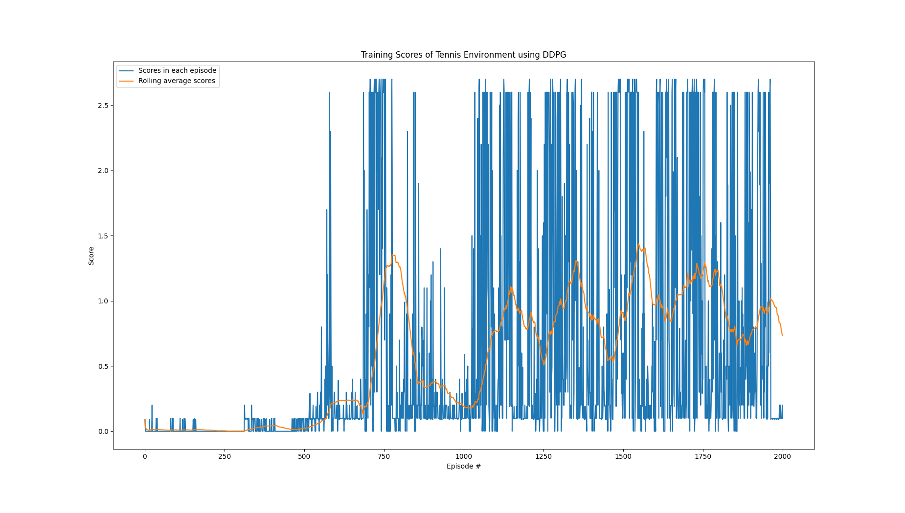

[//]: # (Image References)

[image1]: https://user-images.githubusercontent.com/10624937/42135623-e770e354-7d12-11e8-998d-29fc74429ca2.gif "Trained Agent"

### 0. Introduction

In particular this project, we will work with the [Tennis](https://github.com/Unity-Technologies/ml-agents/blob/master/docs/Learning-Environment-Examples.md#tennis) environment.

In this environment, two agents control rackets to bounce a ball over a net. If an agent hits the ball over the net, it receives a reward of +0.1.  If an agent lets a ball hit the ground or hits the ball out of bounds, it receives a reward of -0.01.  Thus, the goal of each agent is to keep the ball in play.

The observation space consists of 8 variables corresponding to the position and velocity of the ball and racket. Each agent receives its own, local observation.  Two continuous actions are available, corresponding to movement toward (or away from) the net, and jumping. 

The task is episodic, and in order to solve the environment, your agents must get an average score of +0.5 (over 100 consecutive episodes, after taking the maximum over both agents). Specifically,

- After each episode, we add up the rewards that each agent received (without discounting), to get a score for each agent. This yields 2 (potentially different) scores. We then take the maximum of these 2 scores.
- This yields a single **score** for each episode.

This report contains the introduction of the algorithm, and the network architecture. Also we included the training hyperparameters being used and result we achieved.

![Trained Agent][image1]

### 1. Learning Algorithm and Network Architecture

Similar with the [project 2](https://github.com/liuwenbindo/drlnd_continuous_control), we are also using DDPG algorithm (Deep Deterministic Policy Gradient algorithm), which involves 2 networks in the model, similar to the actor-critic architecture. This algorithm is able to let agent make actions in continuous action space, and it also allows multi-agent to learn simultaneously from the memory buffer.

To provide a quick recap on the DDPG algorithm:

- DDPG is a policy gradient algorithm that uses a stochastic behavior policy for good exploration but estimates a deterministic target policy, which is much easier to learn. Policy gradient algorithms utilize a form of policy iteration: they evaluate the policy, and then follow the policy gradient to maximize performance. Since DDPG is off-policy and uses a deterministic target policy, this allows for the use of the Deterministic Policy Gradient theorem (which will be derived shortly). DDPG is an actor-critic algorithm as well; it primarily uses two neural networks, one for the actor and one for the critic. These networks compute action predictions for the current state and generate a temporal-difference (TD) error signal each time step. The input of the actor network is the current state, and the output is a single real value representing an action chosen from a continuous action space (whoa!). The critic’s output is simply the estimated Q-value of the current state and of the action given by the actor. The deterministic policy gradient theorem provides the update rule for the weights of the actor network. The critic network is updated from the gradients obtained from the TD error signal.

Specifically, we have actor and critic networks in the model. The actor network takes a state vector (24 elements) as input and returns an action vector (2 elements). It was implemented with the following deep neural network structure: it has a 24 dimensional input layer, two hidden layers with 128 neurons and ReLU activations and a 2 dimensional output layer with a tanh activation to ensure that the predicted actions are in the range -1 to +1. Batch normalisation was applied to the input and two hidden layers.

The critic network takes the state and action vectors as input, and returns a scalar Q value as output. The critic network has similar structure with the actor network, the only difference lies in the hidden layers. For critic network, the outputs of the first layer were batch normalized and concatenated with the 2 dimensional action vector as input to the second hidden layer, which also has 128 neurons with ReLU activations. But the output of the second layer only has 1 node and outputs a single real number.

### 2. Hyper-parameters

We used the following hyperparameters in the training process:

```
BUFFER_SIZE = int(1e5)  # replay buffer size
BATCH_SIZE = 128        # minibatch size
GAMMA = 0.99            # discount factor
TAU = 1e-3              # for soft update of target parameters
LR_ACTOR = 1e-3         # learning rate of the actor 
LR_CRITIC = 1e-3        # learning rate of the critic
WEIGHT_DECAY = 0        # L2 weight decay

```
Also, to improve the exploration of the training, the predicted actions were corrupted with noise based on an Ornstein-Uhlenbeck process with mean `mu = 0`, mean reversion rate `theta = 0.15` and variance `sigma = 0.1`.

### 3. Training Scores

The agent was able to solve the environment by achieving average score of +0.5 over 100 consecutive episodes after about 1100 episodes. We didn't stop training after the environment was solved to observe how the performance can change with longer training time. It turns out we observe best performance in the period of episode 1100 to 1800, then the average score started to decrease slowly, this may due to the unstable nature of multi-agent learning algorithm.


### 4. Training Output

```
Episode 100	Average Score: 5.59
Episode 200	Average Score: 23.48
Episode 300	Average Score: 26.13
Episode 400	Average Score: 26.28
Episode 500	Average Score: 28.15
Episode 600	Average Score: 24.98
Episode 700	Average Score: 26.39
Episode 800	Average Score: 27.78
Episode 900	Average Score: 28.27
Episode 1000	Average Score: 28.86
Episode 1023	Average Score: 30.01
Environment solved in 1023 episodes!	Average Score: 30.01
```

### 5. Future Improvements
The amount of experimentation that could be performed was somewhat limited by the amount of time is required to perform training; so an obvious first point is further experimentation on the network architecture to find a more optimum actor and critic architecture. Some other thoughts include:

 - Introduce a decay to the noise added to the action to improve stability.
 - Use a priority algorithm for sampling from the replay buffer instead of uniformly sampling
 - Use alternative learning algorithms like PPO with team spirit and the multi-agent DDPG algorithm described  that uses centralised training and decentralised execution. 
